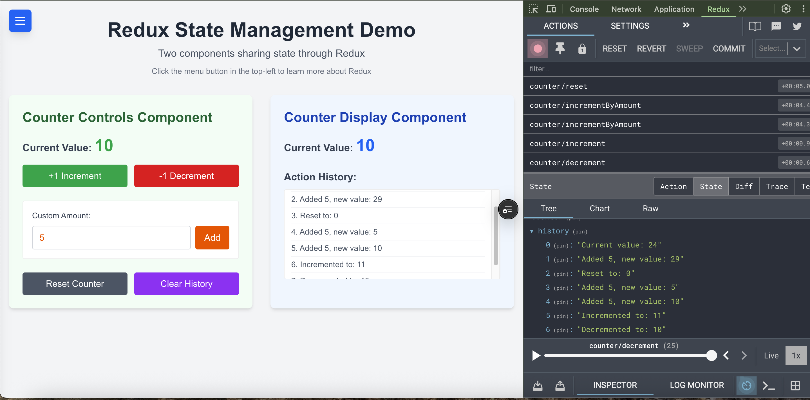

# Redux NextJS Demo

## When to use Redux:

• **Complex State:** When managing large amounts of application state becomes difficult
• **Shared State:** When multiple components need access to the same state data
• **Predictable Updates:** When you need a single source of truth for your app's state
• **State History:** When you need to track how state changes over time
• **Performance:** When state updates need to be optimized for larger applications
• **Developer Tools:** When you need powerful debugging capabilities

## Redux Core Concepts:

• **Store:** Single source of truth for your app's state
• **Actions:** Plain objects describing what happened
• **Reducers:** Pure functions that specify how state changes
• **Dispatch:** Method to send actions to the store
• **Selectors:** Functions to extract data from the store

## This Demo Shows:

• Two components sharing the same state
• Actions dispatched from one component
• State updates reflected in both components
• Action history tracking
• TypeScript integration

## Redux Chrome dev tools
Install the redux chrome dev tools to get superpowers and check redux state in order to debug your application:
